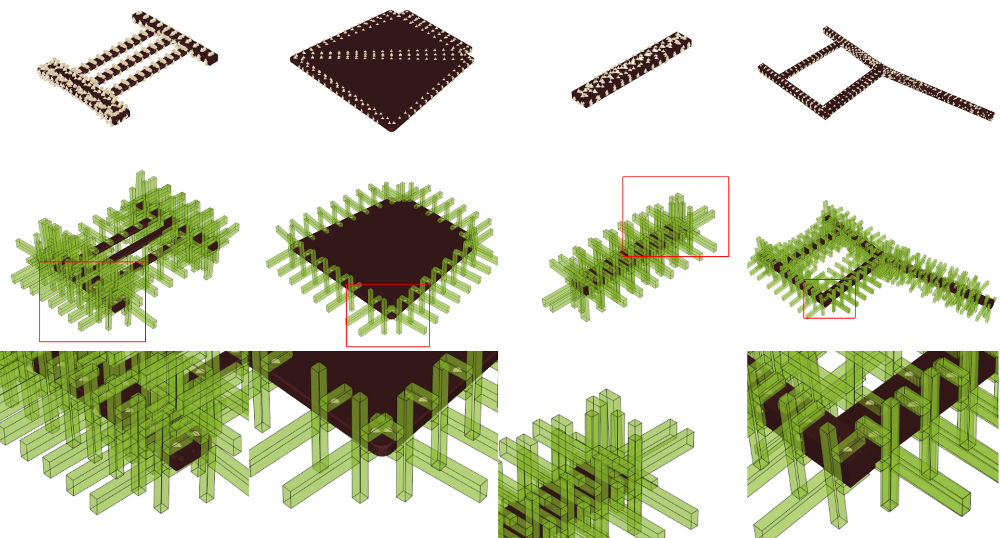

# Grasp Pose Candidates Generator for Furniture Assembly Tasks (F-GPG)
 

  

## 1. Overview
   - Author: Suhan Park (psh117@snu.ac.kr)
   - License: BSD
   - Description: This packages generates grasp pose candidates for furniture assembly tasks with more strict antipodal points and more tight grasp depth.



## 2. Requirements
   - ROS (ros-*-desktop-full version is required, tested environment: melodic)

## 3. Compilation

```sh
cd ~/catkin_ws/src # your ROS workspace
git clone https://github.com/psh117/fgpg
cd ~/catkin_ws
catkin_make
```

## 4. Execution


```sh
rosrun fgpg fgpg config/options.yaml model.stl
```

## 5. Configurations
Some explainations are written in config/options.yaml

## 6. Useful links
   - atenpas/gpg [github link](https://github.com/atenpas/gpg)